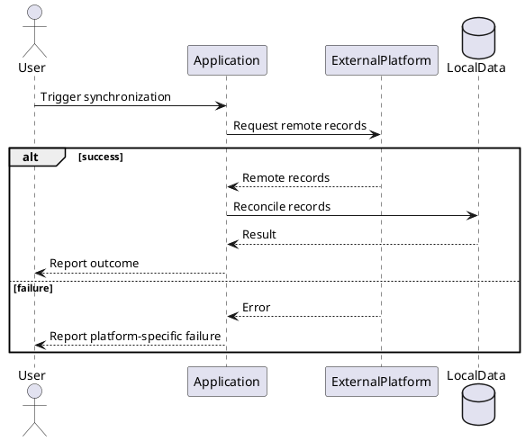

# SPEC.md Standard 0.2.0

**Status:** Draft  
**Version:** 0.2.0  
**Purpose:** A lightweight, LLM-friendly standard for implementation-independent software specifications.

---

## 0. Introduction

**Tagline:** **Portable Ideas and Designs.**

> **Source code is one implementation of an idea.  
> SPEC.md is the transferable expression of the idea itself.**

`SPEC.md` is an open, Markdown-based specification format for expressing an idea, design, system, behavior, rule set, or contract independently of any particular implementation.

For software and digital systems, SPEC.md defines **what the system must do, what must remain true, and what constitutes a conforming implementation**. The same principles may also be used for non-software designs whose behavior and constraints can be expressed precisely.

The primary design goal is **clean-room independent implementation**:

> A competent human or LLM, without access to the original implementation, source code, development history, hidden context, or this SPEC.md standard, should be able to understand the design and independently create a conforming implementation from the resulting `SPEC.md` artifact and any normative companion documents it explicitly references.

`SPEC.md` is therefore not documentation of one implementation. It is the portable expression of the design itself.

A conforming implementation may use a different:

- programming language;
- framework;
- database;
- infrastructure;
- deployment platform;
- internal architecture;
- source-code organization;
- visual design;

unless the specification explicitly constrains one of those choices.

A conforming implementation must preserve the specified:

- domain semantics;
- normative requirements;
- system invariants;
- externally observable behavior;
- external contracts;
- security and privacy properties;
- behaviorally significant user experience;
- constraints and non-goals;
- verification and acceptance conditions.

### 0.1 Design influences

This standard is inspired by established requirements, specification, and behavior-description practices, including:

- ISO/IEC/IEEE 29148, Requirements Engineering;
- MIL-STD-961E, Defense and Program-Unique Specifications Format and Content;
- BCP 14, comprising RFC 2119 and RFC 8174, for normative keywords;
- Behavior-Driven Development and Gherkin conventions for readable acceptance examples;
- the EARS (Easy Approach to Requirements Syntax) family of constrained requirement patterns;
- lightweight repository-native Markdown conventions such as DESIGN.md.

SPEC.md does not claim conformance to these standards or methods unless explicitly stated. It adapts useful principles from them for portable, human-readable, and LLM-readable design specifications.

### 0.2 Standard philosophy

The standard follows six principles:

1. **Precise** — required behavior should be difficult to misinterpret.
2. **Verifiable** — important requirements should admit objective evidence of conformance.
3. **Portable** — the design should survive a complete change of implementation environment.
4. **Self-describing** — an implementer should not need this standard to understand a produced SPEC.md.
5. **Open** — the format should remain tool-neutral, vendor-neutral, and usable without proprietary infrastructure.
6. **Lightweight** — rigor should be added only where it improves understanding, fidelity, safety, or reuse.

### 0.3 Design Portability Principle

> A SPEC.md should capture the valuable design decisions and behavioral contract of an idea in a form that can outlive any particular codebase, framework, vendor, organization, or implementation.

The purpose of SPEC.md is not to prescribe a development workflow. It is to make good ideas and designs easier to understand, share, study, adapt, and independently implement.

SPEC.md is intentionally compatible with many workflows. A team may use it with its own planning process, coding agents, architecture practice, issue tracker, or implementation framework.

---

# 1. Conformance Model

## 1.1 SPEC.md Core

A conforming `SPEC.md` uses the Core structure defined by this standard.

The Core defines the minimum semantic structure needed to communicate a system independently of its implementation.

The Core chapters are:

1. Overview and Scope
2. Context and Definitions
3. System Model
4. Requirements
5. Interfaces and External Contracts
6. Constraints and Non-Goals
7. Verification and Acceptance
8. Notes and Rationale

A project may omit empty subsections inside those chapters.

## 1.2 SPEC.md Optional

SPEC.md Optional defines recommended extensions that may improve rigor, clarity, traceability, or implementation efficiency.

Optional extensions include, among others:

- recommended requirement categories;
- stable requirement identifiers;
- conceptual/logical ERD notation;
- behavioral flow diagrams;
- PlantUML or Mermaid conventions;
- traceability through `TRACE.md`;
- normative integration companion documents;
- monitoring and operational guidance;
- delivery and lifecycle guidance;
- implementation-order guidance;
- optional execution planning through `TASKS.md`;
- optional EARS-style requirement authoring;
- human-only authoring comments.

Optional extensions do not become mandatory merely because they are defined by this standard.

## 1.3 Self-describing artifact requirement

A produced SPEC.md must be understandable without requiring the implementer to read this standard.

When a SPEC.md uses conventions whose interpretation is necessary for correct implementation, the SPEC.md itself must explain those conventions.

A strong quality test is:

> Can a competent unfamiliar LLM be given the SPEC.md and the instruction “Implement the system defined in SPEC.md” and proceed correctly without additional interpretation instructions?

If not, the specification is incomplete, insufficiently self-describing, or overly dependent on hidden conventions.

## 1.4 Normative companion documents

A SPEC.md may delegate detail to companion documents.

If a companion document contains information necessary for conformance:

- SPEC.md must reference it directly;
- SPEC.md must identify it as normative;
- it must be discoverable from the SPEC.md artifact;
- it must not require access to the original source code to understand its contract.

Example:

```markdown
The Instantly integration MUST conform to
`docs/integrations/instantly.md`.

That document is normative for this specification.
```

References such as “see the implementation for details” do not satisfy this rule.

## 1.5 Specification Sets and Modular Composition

A small design may be fully specified in one `SPEC.md`.

A larger design MAY use a **Specification Set** consisting of a root `SPEC.md` plus directly referenced normative modules.

Recommended structure:

```text
SPEC.md
spec/
  identity.md
  users.md
  campaigns.md
  reporting.md
  integrations/
    provider-a.md
    provider-b.md
```

The root `SPEC.md` remains the canonical entry point.

If normative modules are used, the root SPEC.md MUST:

- identify each normative module needed for conformance;
- make the module discoverable by a stable relative reference;
- define global terminology, global invariants, and interpretation rules that apply across modules;
- define how conflicts between the root and modules are handled.

A normative module MAY refine a general rule within its explicitly defined scope.

A normative module MUST NOT silently contradict or override a global normative requirement.

If a module is allowed to override a root rule, that authority MUST be explicitly granted by the root SPEC.md.

Recommended precedence:

1. explicit global normative rules in the root `SPEC.md`;
2. explicitly scoped normative module requirements;
3. other explicitly normative companion contracts;
4. informative examples, rationale, notes, and guidance.

A Specification Set should be decomposed around coherent concepts, capabilities, bounded contexts, or interfaces rather than arbitrary file size.

The purpose of modular composition is to keep a design understandable and maintainable without losing a single authoritative entry point.

---

# 2. Self-Describing Orientation Layer

A conforming SPEC.md should contain a short orientation layer near the beginning of the file.

The exact wording is not prescribed, but it should communicate the following concepts when relevant.

## 2.1 Specification Contract

Recommended form:

```markdown
## Specification Contract

This document defines the required behavior of the system.

A conforming implementation MAY use a different programming
language, framework, database, infrastructure, source structure,
or visual implementation unless explicitly constrained here.

Normative terms:
- MUST / MUST NOT — mandatory
- SHOULD / SHOULD NOT — recommended
- MAY — optional

Requirements and explicitly normative statements define conformance.

Examples, rationale, notes, historical context, and implementation
guidance are informative unless explicitly marked normative.

If implementation documentation or source code conflicts with this
specification, this specification is authoritative for required
system behavior.

If two normative statements conflict and the conflict cannot be
resolved from this specification, the implementer MUST surface the
conflict rather than silently choose an interpretation.
```

## 2.2 Implementation Freedom

The produced SPEC.md should make implementation freedom explicit.

Recommended form:

```markdown
### Implementation Freedom

Unless explicitly constrained, an implementation MAY change:

- programming language;
- frameworks and libraries;
- database technology;
- infrastructure;
- internal architecture;
- source-code organization;
- visual design.

It MUST preserve:

- required behavior;
- domain semantics;
- invariants;
- external contracts;
- security and privacy properties;
- explicitly required UX behavior;
- verification and acceptance criteria.
```

## 2.3 System at a Glance

For non-trivial systems, a short system summary is recommended.

It may list:

- actors;
- core entities;
- primary flows;
- external systems;
- major data authorities;
- critical boundaries.

The purpose is orientation, not duplication of the detailed specification.

## 2.4 Critical Invariants Summary

Where the system has high-risk global invariants, a short summary near the beginning is recommended.

Example:

```markdown
## Critical Invariants

- The system MUST always retain at least one usable administrator.
- Blocking a user MUST take effect on the next protected request.
- Deleting a Lead List MUST NOT delete its Leads.
```

Detailed requirements may appear later.

---

# 3. Normative Language and Interpretation

## 3.1 Normative terms

The normative keywords **MUST**, **MUST NOT**, **SHOULD**, **SHOULD NOT**, and **MAY** follow the meanings of BCP 14 (RFC 2119 and RFC 8174) when written in uppercase as shown.

In practical SPEC.md usage:

- **MUST** — mandatory for conformance.
- **MUST NOT** — prohibited for conformance.
- **SHOULD** — recommended; deviation requires a valid reason.
- **SHOULD NOT** — normally avoided; deviation requires a valid reason.
- **MAY** — permitted but optional.

`SHALL` and `SHALL NOT` MAY be used where an adopted requirement pattern requires them, such as an EARS-style statement, but `MUST` and `MUST NOT` are preferred in ordinary SPEC.md prose.

## 3.2 Normative versus informative content

The specification should distinguish required behavior from explanation.

The following headings are informative by default unless explicitly marked normative:

- Rationale
- Background
- Example
- Notes
- Historical Context
- Alternatives Considered
- Implementation Guidance

An informative section must not silently introduce a requirement.

## 3.3 Interpretation precedence

When statements appear inconsistent, a produced SPEC.md should define or follow this precedence unless it explicitly states another rule:

1. Explicit normative requirements take precedence over examples.
2. Specific normative requirements take precedence over general descriptive prose.
3. Current normative requirements take precedence over historical rationale.
4. Explicitly normative companion documents have the authority assigned to them by SPEC.md.
5. An unresolved conflict between normative statements must be surfaced rather than silently resolved.

## 3.4 Atomic requirements

Normative statements should express one independently understandable obligation whenever practical.

Preferred:

```markdown
Synchronization MUST create locally unknown remote Campaigns.

Synchronization MUST refresh matching local Campaigns.

Synchronization MUST NOT delete a local Campaign solely because
it is absent from a synchronization response.
```

Avoid combining multiple independently testable obligations into one long sentence.

## 3.5 Explicit defaults

Where omission could reasonably lead to materially different implementations, the specification should state the default.

Example:

```markdown
A Lead MAY belong to one Campaign.

By default, a newly created Lead has no Campaign.

A Lead MUST NOT belong to more than one Campaign simultaneously.
```

## 3.6 Negative requirements

Intentional prohibitions should be stated explicitly.

Example:

```markdown
Lead email addresses are not unique.

The implementation MUST NOT:
- reject a Lead solely because another Lead uses the same email;
- automatically merge Leads based on email;
- automatically deduplicate imported Leads.
```

## 3.7 Canonical terminology

A concept should have one canonical term in normative text.

Defined terms should not be replaced by informal synonyms where doing so could introduce ambiguity.

External terminology may be mapped to local terminology explicitly.

Example:

```text
Woodpecker "Prospect" → local Lead concept
```

## 3.8 Uncertainty

Unresolved matters should be marked explicitly.

Recommended markers include:

- `TBD`
- `Open Issue`
- `Unverified`

An implementer must not silently convert an explicitly unresolved item into a requirement.

---

# 4. Core Document Structure

## 4.1 Overview and Scope

This chapter defines the purpose and boundary of the system.

Recommended content:

- purpose;
- product or system goals;
- system boundary;
- intended users or actors;
- major in-scope capabilities;
- major out-of-scope areas.

The chapter should answer:

> What system is being specified, for whom, and where does its responsibility begin and end?

## 4.2 Context and Definitions

This chapter defines terminology and interpretation context.

Recommended content:

- domain terms;
- abbreviations;
- normative references;
- informative references;
- assumptions;
- representation conventions.

### 4.2.1 Assumptions

Assumptions describe environmental conditions under which the specification was written.

They are not implementation requirements unless a normative statement explicitly depends on them.

Example:

```markdown
### Assumptions

- The deployment serves one organization.
- Human-triggered synchronization is low-concurrency.
```

### 4.2.2 Representation Conventions

Where ambiguity would otherwise arise, normative data should use locale-independent standardized representations.

Recommended defaults:

- dates: ISO 8601 `YYYY-MM-DD`;
- timestamps: ISO 8601 with `Z` or explicit UTC offset;
- named time zones: IANA identifiers such as `Asia/Jerusalem`;
- currencies: ISO 4217 codes such as `USD`, `EUR`, `ILS`;
- countries: ISO 3166-1 alpha-2 codes;
- languages: BCP 47 language tags;
- decimal numbers: `.` as decimal separator, no grouping separator;
- units: SI or another explicitly named standard;
- structured booleans: `true` / `false`;
- text encoding: UTF-8.

Unless explicitly stated otherwise:

- `null`;
- absent;
- empty string;
- empty collection;
- numeric zero;
- boolean false;

are distinct semantic values.

User-facing representations may be localized independently of the normative representation.

## 4.3 System Model

This chapter defines the implementation-independent structure and behavior of the system.

Recommended content:

- actors;
- conceptual domain model;
- logical entity model;
- relationships and cardinalities;
- state models;
- lifecycle rules;
- behavioral flows;
- system invariants.

### 4.3.1 Conceptual and logical data model

SPEC.md may define both:

**Conceptual model** — business/domain concepts.

**Logical model** — entities, behaviorally significant attributes, relationships, cardinalities, lifecycle semantics, and invariants.

The physical model belongs to implementation design documentation.

Example:

```text
Lead * → 0..1 Campaign
Campaign 1 → 0..* Lead
```

If deletion behavior is part of the product contract, state the behavior directly:

```markdown
Deleting a Campaign MUST NOT delete its Leads.

Affected Leads MUST remain in the system without a Campaign
assignment.
```

A physical database choice such as `ON DELETE SET NULL` is not required unless that mechanism itself is a constraint.

### 4.3.2 Entity Relationship Diagrams

An ERD may be included as a visualization.

Text-based formats such as Mermaid or PlantUML are recommended.

Unless explicitly marked normative, a diagram is informative and the prose/structured model remains authoritative.

### 4.3.3 Behavioral flows

Behavioral flows may be used where ordering, state transition, data movement, or failure behavior matters to conformance.

Examples include:

- use-case flows;
- logical sequence flows;
- state-transition flows;
- activity/business-process flows;
- failure/degraded flows;
- data flows.

SPEC.md flows should use logical actors and systems rather than source-code functions, classes, modules, or files.

Implementation-specific call flows belong in design documentation.

## 4.4 Requirements

This chapter contains the normative requirements of the system.

The Core standard does not mandate a particular internal taxonomy.

Requirements may be organized by feature, concern, subsystem, use case, or another structure suitable to the system.

Recommended requirement categories are defined under SPEC.md Optional.

A requirement should be:

- necessary;
- clear;
- unambiguous;
- singular where practical;
- feasible;
- verifiable;
- consistent;
- implementation-independent unless implementation itself is constrained.

## 4.5 Interfaces and External Contracts

This chapter defines contracts between the specified system and external actors, systems, protocols, or services.

It should describe enough behavior for an independent implementation to interoperate correctly.

For third-party systems, relevant information may include:

- purpose and role;
- system-of-record/data authority;
- authentication and credential handling;
- supported operations;
- prohibited operations;
- data mappings;
- synchronization direction;
- consistency/conflict behavior;
- rate limits and quotas;
- failure behavior;
- idempotency;
- retries;
- security and privacy;
- API/version compatibility;
- verification expectations.

Complex provider-specific details may be placed in normative companion documents referenced directly from SPEC.md.

## 4.6 Constraints and Non-Goals

This chapter states deliberate boundaries.

It may include:

- technical constraints that are genuine requirements;
- security constraints;
- regulatory constraints;
- compatibility constraints;
- explicitly excluded features;
- deliberately unsupported behavior.

Non-goals are particularly important where an implementer or LLM might otherwise infer an “obvious” enhancement.

## 4.7 Verification and Acceptance

This chapter describes how conformance can be demonstrated.

Recommended verification methods:

- **Test** — execute the system and evaluate expected results.
- **Analysis** — determine conformance through calculation, reasoning, or analysis of evidence.
- **Inspection** — examine an artifact, configuration, document, or implementation.
- **Demonstration** — operate the capability to demonstrate required behavior.

A project may use other verification methods if defined.

Behavior-heavy requirements may include acceptance criteria.

`Given / When / Then` acceptance criteria are inspired by Behavior-Driven Development and Gherkin conventions. They are readable acceptance descriptions and are not required to be executable Gherkin unless explicitly declared as such.

Example:

```markdown
### Immediate Blocking Acceptance

Given:
- User U is authenticated.
- U is currently not blocked.

When:
- Administrator A blocks U.

Then:
- U's next protected request MUST be denied.
- U MUST NOT need to log out first.
```

## 4.8 Notes and Rationale

This chapter is informative unless explicitly stated otherwise.

It may include:

- rationale;
- historical context;
- alternatives considered;
- known limitations;
- future considerations.

Requirements should not be hidden inside this chapter.

---

# 5. SPEC.md Optional

This chapter defines optional conventions and extensions.

A project may use any subset that improves its specification.

## 5.1 Recommended Requirements Organization

The Requirements chapter may use any relevant subset of the following categories:

1. Functional Requirements
2. Domain and Data Requirements
3. System Invariants
4. Business Rules and State Behavior
5. Authentication and Authorization
6. Security
7. Privacy and Data Protection
8. User Experience and Interaction Requirements
9. Accessibility Requirements
10. Discoverability, SEO, and Machine Readability
11. External Integration Requirements
12. Performance and Capacity
13. Reliability and Resilience
14. Monitoring, Observability, and Alerting
15. Audit and Accountability
16. Operational Requirements
17. Delivery, Deployment, and Lifecycle Requirements
18. Compatibility and Portability
19. Compliance Requirements

Projects should include only categories that materially apply.

Empty categories should be omitted.

### 5.1.1 User Experience and Interaction Requirements

UX requirements belong in SPEC.md when they define behaviorally or experientially significant properties of the system.

Examples:

- information architecture;
- task flows;
- interaction behavior;
- feedback and system status;
- user-visible error handling;
- responsive behavior;
- internationalization and directionality.

Purely visual implementation choices normally belong outside SPEC.md unless they are themselves contractual requirements.

### 5.1.2 Discoverability, SEO, and Machine Readability

This category may define requirements for public discovery by search engines, AI systems, crawlers, or machine consumers.

Examples include:

- independent crawlable language URLs;
- canonicalization;
- metadata;
- structured data;
- sitemap behavior;
- crawler access;
- machine-readable semantic content.

The required property should be specified rather than prescribing a particular technique unless that technique itself is required.

### 5.1.3 Monitoring, Observability, and Alerting

This category may define:

- health and availability observability;
- metrics;
- telemetry;
- diagnostic logging;
- dependency monitoring;
- alerting;
- service-level objectives.

Monitoring should be distinct from Audit and Accountability.

Monitoring asks whether the system is healthy.

Audit asks who performed an action, when, and to what.

### 5.1.4 Operational Requirements

Operational requirements concern the system while running.

Examples:

- backup and recovery;
- restart behavior;
- runtime configuration;
- maintenance;
- health;
- recoverability.

### 5.1.5 Delivery, Deployment, and Lifecycle Requirements

These requirements concern how a version becomes the running system.

Examples:

- automated validation before release;
- release traceability;
- safe migration ordering;
- environment promotion;
- deployment failure handling;
- rollback;
- secret handling.

The specification should define the required delivery property rather than a specific CI/CD product unless that technology itself is a requirement.

## 5.2 Optional EARS-Style Requirement Authoring

A project MAY use EARS-style constrained requirement sentences when the additional structure improves clarity or machine extraction.

Typical patterns include:

```text
WHEN <trigger>
THE SYSTEM SHALL <required response>
```

```text
WHILE <state>
THE SYSTEM SHALL <required behavior>
```

```text
IF <undesired condition>
THEN THE SYSTEM SHALL <required response>
```

Example:

```markdown
### AUTH-004 — Immediate blocking

WHEN a blocked user makes a protected request,
THE SYSTEM SHALL deny the request.
```

Within an explicitly EARS-style requirement, `SHALL` has mandatory force equivalent to `MUST`.

EARS is optional. It SHOULD NOT be forced onto requirements that are clearer as direct invariants.

Example:

```markdown
A Campaign MUST NOT contain a Lead owned by another organization.
```

is preferable to artificially rewriting the invariant as an event-triggered sentence.

## 5.3 Stable Requirement Identifiers

A project may assign stable semantic identifiers to requirements.

Examples:

```text
AUTH-004
DATA-012
INT-007
MON-003
```

Identifiers should remain stable when requirements move within the document.

Removed identifiers should not be reused.

Section numbering expresses order.

Requirement IDs express identity.

The two should not be conflated.

## 5.4 Behavioral Flow Identifiers

Behavioral flows may receive stable identifiers, for example:

```text
FLW-001
FLW-SYNC-004
```

Requirements may reference a flow where the flow clarifies required interaction ordering.

## 5.5 Text-Based Diagram Languages

PlantUML and Mermaid are recommended text-based diagram formats because they are:

- diffable;
- version-control friendly;
- machine-readable;
- LLM-readable.

Neither format is mandatory.

Unless explicitly marked **Normative**, diagrams are informative representations of normative textual behavior.

## 5.6 External Integration Companion Documents

A complex provider contract may live in:

```text
docs/integrations/<provider>.md
```

The provider document may contain:

- endpoints;
- request/response shape;
- authentication;
- pagination;
- status mappings;
- rate limits;
- verified provider quirks;
- API-version notes.

If necessary for conformance, SPEC.md must identify the document as normative.

## 5.7 TRACE.md

`TRACE.md` is an optional implementation-specific companion document.

Its purpose is to map:

```text
Requirement → Design → Implementation → Verification
```

Example:

```markdown
| Requirement | Design | Implementation | Verification |
|---|---|---|---|
| AUTH-004 | DES-AUTH-02 | `src/auth/...` | `tests/auth/...` |
```

TRACE.md must not redefine a requirement.

SPEC.md remains authoritative for behavior.

TRACE.md may be regenerated when the system is reimplemented in a different stack.

## 5.8 DESIGN.md

`DESIGN.md` may describe one implementation chosen to satisfy SPEC.md.

Depending on the project, it may contain:

- architecture;
- implementation topology;
- physical database model;
- component structure;
- internal call flows;
- technology choices;
- implementation-specific constraints.

DESIGN.md does not override SPEC.md's behavioral contract.

## 5.9 TASKS.md

`TASKS.md` is an optional prospective execution artifact.

Its purpose is to translate an approved specification and, where applicable, an implementation design into an ordered or dependency-aware set of implementation tasks.

A typical relationship is:

```text
SPEC.md
  ↓
DESIGN.md
  ↓
TASKS.md
  ↓
Implementation
  ↓
TRACE.md
```

`TASKS.md` is implementation-specific, derived, and regenerable.

It MUST NOT introduce new product or system requirements that do not originate in the normative specification.

A task MAY reference:

- requirement IDs;
- design decisions;
- dependencies;
- implementation work;
- verification work.

Example:

```markdown
### TASK-014 — Enforce blocked-user access

Implements:
- AUTH-004

Depends on:
- TASK-009

Work:
- enforce blocked state during protected-request authorization;
- invalidate any implementation-specific cached authorization decision.

Verification:
- execute the AUTH-004 acceptance test.
```

TASKS.md is not part of the portable behavioral contract.

## 5.10 AGENTS.md

`AGENTS.md` may contain repository-specific instructions for coding agents.

It may define:

- build commands;
- test commands;
- repository conventions;
- agent working rules.

It is not part of the portable behavioral specification.

## 5.11 Implementation Guidance

SPEC.md may include informative implementation guidance for an LLM or developer.

This may include:

- recommended implementation priority;
- recommended build sequence;
- implementation dependencies.

Example:

```markdown
## Recommended Implementation Order

This section is informative. A conforming implementation MAY use a
different implementation order.

1. Establish the domain model.
2. Implement authentication and authorization.
3. Implement core workflows.
4. Add read-only external integrations.
5. Add guarded write operations.
6. Complete operational verification.
```

If ordering affects externally observable behavior, safety, correctness, data integrity, or lifecycle guarantees, it is not merely implementation guidance and should instead be expressed normatively in the relevant requirement or flow.

## 5.12 Human-Only Comments

SPEC.md may contain comments intended exclusively for human maintainers.

Canonical syntax:

```markdown
<!-- SPECMD-HUMAN-ONLY
This is an editorial note for human maintainers.
SPECMD-END-HUMAN-ONLY -->
```

When this extension is used, the SPEC.md artifact itself must explain the convention.

Recommended self-describing declaration:

```markdown
### Human-only comments

Content enclosed between:

`<!-- SPECMD-HUMAN-ONLY`

and

`SPECMD-END-HUMAN-ONLY -->`

is not part of this specification.

Implementers and LLMs MUST completely disregard its contents when
interpreting requirements, resolving ambiguity, making design
decisions, or determining conformance.

Tooling SHOULD remove these blocks before supplying SPEC.md to an LLM.
```

Human-only comments must not contain information necessary to implement or verify the system.

Appropriate uses include:

- drafting reminders;
- editorial notes;
- human review questions;
- coordination comments.

## 5.13 Requirement and Flow Diagrams in Separate Files

Large projects may place diagrams in separate files such as:

```text
docs/flows/campaign-sync.puml
docs/flows/login.mmd
```

If a diagram is necessary for understanding normative behavior, SPEC.md must reference it directly.

---

# 6. Third-Party Integration Guidance

Third-party integrations deserve explicit treatment because interoperability errors can make a reimplementation behaviorally incorrect even when its local logic is sound.

A recommended provider section is:

```markdown
### <Provider>

#### Purpose and Role
#### Data Authority
#### Authentication and Credentials
#### Supported Operations
#### Prohibited Operations
#### Data Contracts and Mapping
#### Synchronization and Consistency
#### Rate Limits and Quotas
#### Failure Behavior
#### Idempotency and Retry Behavior
#### Security and Privacy
#### Versioning and Compatibility
#### Verification
```

## 6.1 Data authority

The specification should identify who owns the authoritative value for relevant data.

Common patterns include:

- local authoritative;
- third-party authoritative;
- replicated/cache;
- merged;
- read-only projection.

## 6.2 Supported and prohibited operations

A provider integration should use an explicit allowlist when API capability exceeds product scope.

Example:

```markdown
Supported:
- read campaigns;
- read statistics;
- pause campaign;
- activate campaign.

Prohibited:
- create campaign;
- delete campaign;
- send arbitrary email.
```

An LLM must not infer product scope merely because a third-party API supports an operation.

## 6.3 Synchronization semantics

Where relevant, specify:

- pull, push, or bidirectional;
- creation/upsert behavior;
- conflict resolution;
- deletion handling;
- freshness;
- idempotency;
- retry behavior.

These are behavioral contracts and belong in SPEC.md when required for equivalence.

---

# 7. Modeling Guidance

## 7.1 Three model levels

SPEC.md distinguishes:

### Conceptual model

Business/domain concepts.

**Location:** SPEC.md.

### Logical model

Entities, relationships, cardinalities, behaviorally significant attributes, lifecycle semantics, and invariants.

**Location:** SPEC.md.

### Physical model

Tables, columns, indexes, foreign-key mechanics, storage-specific structures, denormalization, partitions, and persistence implementation.

**Location:** implementation design documentation such as DESIGN.md.

## 7.2 Behavioral consequence over mechanism

If the behavior matters, specify the consequence.

Preferred:

```markdown
Deleting a Campaign MUST NOT delete its Leads.

Affected Leads MUST become unassigned.
```

Implementation-specific:

```sql
campaign_id UUID REFERENCES campaigns(id) ON DELETE SET NULL
```

The first belongs in SPEC.md.

The second belongs in DESIGN.md unless the database mechanism itself is constrained.

---

# 8. Versioning

## 8.1 SPEC.md Standard version

This standard uses Semantic Versioning notation:

```text
MAJOR.MINOR.PATCH
```

This document is:

```text
0.2.0
```

Pre-1.0 versions are drafts and may change incompatibly.

## 8.2 Product specification version

A project specification should version itself separately from the SPEC.md standard.

Recommended metadata:

```yaml
---
specmd: "0.2.0"
spec_version: "2.4.1"
status: active
supersedes: "2.4.0"
last_updated: "2026-09-11"
---
```

## 8.3 Specification Semantic Versioning

For a project specification:

### MAJOR

Increment MAJOR when a previously conforming implementation may no longer conform.

Examples:

- mandatory behavior changes incompatibly;
- a new prohibition invalidates previously permitted behavior;
- cardinality changes;
- a workflow is removed;
- an external contract changes incompatibly.

### MINOR

Increment MINOR for additive changes that preserve previous conformance.

Examples:

- a new optional capability;
- a new `MAY`;
- an additive integration or interface that does not invalidate prior conformance.

### PATCH

Increment PATCH when required behavior does not change.

Examples:

- spelling;
- formatting;
- clarification;
- improved examples;
- additional rationale;
- diagram corrections that do not change normative meaning.

A useful test is:

> Could two correct implementations, one based on the old PATCH and one based on the new PATCH, legitimately behave differently because of the change?

If yes, the change is probably not PATCH-level.

## 8.4 Separation of versions

The following are independent:

```text
SPEC.md Standard version
Product specification version
Software implementation version
```

A code release does not require a specification version change unless the specified behavior changes.

---

# 9. Authoring Quality Rules

A high-quality SPEC.md should aim for the following.

## 9.1 Clean-room completeness

A competent implementer should not need to inspect the original source code to discover required behavior.

## 9.2 Implementation independence

The specification should describe required results and semantics rather than preserving accidental properties of the original implementation.

## 9.3 Behavioral completeness

Important defaults, negative behavior, lifecycle semantics, failure behavior, and data authority should not be left to inference.

## 9.4 Verifiability

Important requirements should admit objective evidence of conformance.

## 9.5 Retrieval clarity

Important information should be easy to locate through headings, stable terminology, tables, or identifiers.

## 9.6 Progressive rigor

A SPEC.md should be as small as possible while still being sufficient for correct independent reimplementation.

Optional rigor should be added when it materially improves fidelity, safety, traceability, or maintainability.

---

# 10. Minimal Example

The following demonstrates a compact conforming structure.

```markdown
---
specmd: "0.2.0"
spec_version: "1.0.0"
status: active
name: Example
---

# Example Specification

## Specification Contract

This document defines the required behavior of the system.

A conforming implementation MAY use any technology unless explicitly
constrained.

MUST / MUST NOT are mandatory.
SHOULD / SHOULD NOT are recommendations.
MAY is optional.

Examples and rationale are informative unless marked normative.

## 1. Overview and Scope

Example is a shared task-tracking application for one organization.

## 2. Context and Definitions

**Task** — a unit of work tracked by the system.

Dates use ISO 8601 `YYYY-MM-DD`.

## 3. System Model

A User may create zero or more Tasks.

A Task has exactly one creator.

Deleting a User MUST NOT delete Tasks they previously created.

## 4. Requirements

### Functional

Users MUST be able to create, edit, and complete Tasks.

### Authorization

Only authenticated users MUST be able to create Tasks.

## 5. Interfaces and External Contracts

The system has no mandatory third-party integrations.

## 6. Constraints and Non-Goals

Multi-tenancy is outside scope.

The system MUST NOT automatically delete completed Tasks.

## 7. Verification and Acceptance

Task creation: Test.

User deletion preservation: Test.

## 8. Notes and Rationale

This section is informative.
```

---

# 11. Relationship to Companion Documents

The recommended document family is:

```text
SPEC.md
    Portable expression of the idea/design and its normative contract.

DESIGN.md
    One implementation/design chosen to satisfy SPEC.md.

TASKS.md
    Optional prospective implementation work derived from SPEC/DESIGN.

TRACE.md
    Optional retrospective mapping:
    Requirement → Design → Implementation → Verification.

AGENTS.md
    Repository/agent-specific operating guidance.
```

Only SPEC.md is required by this standard.

An independent reimplementation should preserve the applicable SPEC.md contract and may generate new DESIGN.md, TASKS.md, TRACE.md, and AGENTS.md documents appropriate to the new implementation.

---

# 12. What SPEC.md Is Not

SPEC.md is not:

- source-code documentation;
- a project plan;
- a backlog;
- a changelog;
- a user manual;
- an architecture document for one implementation;
- a replacement for executable API schemas where those are more appropriate;
- a prompt that must be repeatedly supplied with hidden interpretation rules.

It is the portable, implementation-independent expression of an idea or design from which a conforming realization can be independently created.

---

# 13. Reference Principles for Tooling

Tooling is optional in version 0.1.0.

Future tooling may validate:

- Core chapter presence;
- duplicate requirement IDs;
- broken references;
- unresolved normative conflicts;
- requirement-to-verification coverage;
- human-only comment stripping;
- version metadata;
- normative companion discovery;
- TRACE.md consistency.

Possible future commands may include:

```text
specmd lint
specmd prepare
specmd requirements
specmd trace
specmd diff
specmd status
```

No tool is required for a SPEC.md artifact to be understandable or implementable.

---

# 14. Draft Status of 0.2.0

Version 0.2.0 is the second draft of the SPEC.md standard and introduces modular specification composition, explicit standards attribution, and optional execution-oriented authoring extensions.

The following are intentionally open for refinement before 1.0.0:

- exact Core conformance tests;
- metadata field names;
- optional-extension naming;
- requirement-ID recommendations;
- normative companion-document syntax;
- tooling schemas;
- formal validation rules.

The foundational concepts intended to remain stable are:

1. portable ideas and designs;
2. implementation-independent behavioral specification;
3. clean-room independent implementation;
4. self-describing artifacts;
5. clear normative/informative separation;
6. implementation freedom unless explicitly constrained;
7. Core plus optional rigor;
8. verification as part of specification quality;
9. portable domain and external-contract semantics;
10. single-file simplicity with optional modular Specification Sets;
11. no requirement for access to the original implementation or codebase;
12. no requirement for a special implementation prompt;
13. tool-neutral and workflow-neutral interoperability.

---

# Appendix A — Suggested SPEC.md Skeleton

```markdown
---
specmd: "0.2.0"
spec_version: "0.1.0"
status: draft
name: "<system name>"
last_updated: "YYYY-MM-DD"
---

# <System> Specification

## Specification Contract

<self-describing interpretation rules>

## System at a Glance

<optional concise orientation>

## Critical Invariants

<optional concise invariant summary>

# 1. Overview and Scope

## 1.1 Purpose
## 1.2 Goals
## 1.3 System Boundary
## 1.4 Actors
## 1.5 Scope Summary

# 2. Context and Definitions

## 2.1 Terminology
## 2.2 References
## 2.3 Assumptions
## 2.4 Representation Conventions

# 3. System Model

## 3.1 Actors
## 3.2 Entities
## 3.3 Relationships and Cardinalities
## 3.4 States and Lifecycles
## 3.5 Behavioral Flows
## 3.6 Invariants

# 4. Requirements

<organize as appropriate>

# 5. Interfaces and External Contracts

<external systems and contracts>

# 6. Constraints and Non-Goals

<constraints and deliberate exclusions>

# 7. Verification and Acceptance

<verification methods and acceptance criteria>

# 8. Notes and Rationale

<informative content only>
```

---

# Appendix B — Suggested Optional Requirement Categories

```text
Functional Requirements
Domain and Data Requirements
System Invariants
Business Rules and State Behavior
Authentication and Authorization
Security
Privacy and Data Protection
User Experience and Interaction Requirements
Accessibility Requirements
Discoverability, SEO, and Machine Readability
External Integration Requirements
Performance and Capacity
Reliability and Resilience
Monitoring, Observability, and Alerting
Audit and Accountability
Operational Requirements
Delivery, Deployment, and Lifecycle Requirements
Compatibility and Portability
Compliance Requirements
```

Use only what applies.

---

# Appendix C — Human-Only Comment Example

```markdown
### Human-only comments

Content enclosed between:

`<!-- SPECMD-HUMAN-ONLY`

and

`SPECMD-END-HUMAN-ONLY -->`

is not part of this specification.

Implementers and LLMs MUST completely disregard its contents.

Tooling SHOULD remove these blocks before supplying SPEC.md to an LLM.

<!-- SPECMD-HUMAN-ONLY
Ask the product owner whether this section still needs a diagram.
SPECMD-END-HUMAN-ONLY -->
```

Human-only comments must never contain information necessary for implementation or verification.

---

# Appendix D — Behavioral Flow Example



This diagram is informative unless explicitly marked normative.

---

# Appendix E — Informative References

- ISO/IEC/IEEE 29148:2018, *Systems and software engineering — Life cycle processes — Requirements engineering*.
- MIL-STD-961E, *Defense and Program-Unique Specifications Format and Content*.
- BCP 14: RFC 2119 and RFC 8174, normative requirement keywords.
- Gherkin / Behavior-Driven Development conventions for readable Given/When/Then acceptance descriptions.
- EARS (Easy Approach to Requirements Syntax), constrained requirement-writing patterns.
- DESIGN.md, repository-native Markdown guidance for design context.

