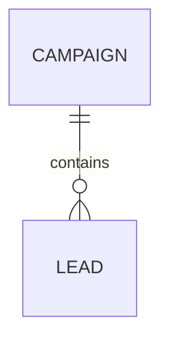

# SPEC.md Optional 0.4.2

**Status:** Draft  
**Companion to:** SPEC.md Core 0.4.2  
**Tagline:** **Portable Ideas & Designs.**

> **Source code is one implementation of an idea.  
> SPEC.md is the transferable expression of the idea itself.**

---

# 0. Purpose

`SPEC.md Optional` defines optional extensions, richer authoring patterns, and companion artifacts for designs that benefit from more structure than SPEC.md Core requires.

SPEC.md Core remains intentionally small and self-contained.

A project MAY use any subset of the optional conventions in this document and MUST NOT include one merely to satisfy a template.

Optional conventions MUST NOT weaken, replace, or silently reinterpret Core requirements.

Unless explicitly stated otherwise, nothing in this document is required for Core conformance.

> **Use an optional feature when it reduces ambiguity, improves portability, or makes the design easier to implement or verify. Omit it when it adds ceremony without improving the design.**

Optional extensions add structure to decisions that already exist. They SHOULD NOT be used to invent missing product behavior or complete an unfinished design.

---

# 1. Optional Requirement Organization

A SPEC.md MAY organize its Requirements chapter using any relevant subset of the following categories:

1. Functional Requirements
2. Domain and Data Requirements
3. System Invariants
4. Business Rules and State Behavior
5. Authentication and Authorization
6. Security
7. Privacy and Data Protection
8. User Experience and Interaction Requirements
9. Accessibility Requirements
10. Discoverability, SEO, and Machine Readability
11. External Integration Requirements
12. Performance and Capacity
13. Reliability and Resilience
14. Monitoring, Observability, and Alerting
15. Audit and Accountability
16. Operational Requirements
17. Delivery, Deployment, and Lifecycle Requirements
18. Compatibility and Portability
19. Compliance Requirements

Projects SHOULD include only categories that materially apply.

Empty categories SHOULD be omitted.

A project MAY organize requirements differently if another structure is clearer.

---

# 2. Requirement Identifier Conventions

SPEC.md Core recommends stable semantic identifiers once requirements exist.

Projects that use them MAY adopt the richer conventions below.

Examples:

```text
FUN-001
DATA-012
AUTH-004
INT-007
SEC-003
MON-002
```

Identifiers SHOULD:

- remain stable when a requirement moves;
- be short and human-readable;
- use a meaningful category prefix;
- be unique within the Specification Set.

Removed identifiers SHOULD NOT be reused.

Section numbering expresses location and order.

Requirement identifiers express identity.

The two SHOULD NOT be conflated.

Example:

```markdown
### AUTH-004 — Immediate account blocking

A blocked user MUST be denied access on the next protected request,
including when holding a previously issued valid session.
```

---

# 3. Optional Requirement Metadata

A requirement MAY include additional metadata when useful.

Example:

```markdown
### AUTH-004 — Immediate account blocking

A blocked user MUST be denied access on the next protected request.

**Rationale:** Prevent continued access after administrative blocking.

**Verification:** Test.

**Related:** AUTH-002, SEC-005.
```

Useful optional metadata includes:

- Rationale
- Verification
- Related
- Traces to
- Priority
- Source
- Risk
- Owner

Metadata SHOULD NOT turn the specification into a project-management database.

Only include metadata that improves implementation or verification.

---

# 4. EARS-Style Requirement Authoring

A project MAY use EARS-style constrained requirement sentences when additional structure improves clarity or machine extraction.

Common patterns include:

## 4.1 Event-driven

```text
WHEN <trigger>
THE SYSTEM SHALL <required response>
```

Example:

```markdown
### AUTH-004 — Immediate blocking

WHEN a blocked user makes a protected request,
THE SYSTEM SHALL deny the request.
```

## 4.2 State-driven

```text
WHILE <state>
THE SYSTEM SHALL <required behavior>
```

## 4.3 Unwanted behavior

```text
IF <undesired condition>
THEN THE SYSTEM SHALL <required response>
```

Within an explicitly EARS-style requirement, `SHALL` has mandatory force equivalent to `MUST`.

EARS is optional.

It SHOULD NOT be forced onto requirements that are clearer as direct invariants.

Example:

```markdown
A Campaign MUST NOT contain a Lead from another organization.
```

is preferable to artificially converting the invariant into event syntax.

---

# 5. Conceptual and Logical Modeling

SPEC.md MAY include conceptual and logical system models.

## 5.1 Conceptual model

The conceptual model describes domain or design concepts independent of implementation.

Examples:

- User
- Campaign
- Lead
- Class
- Schedule
- Order
- Device

## 5.2 Logical model

The logical model may define:

- entities;
- behaviorally significant attributes;
- relationships;
- cardinalities;
- state;
- lifecycle;
- invariants.

Example:

```text
Campaign 1 ---- 0..* Lead
Lead     * ---- 0..1 Campaign
```

If deletion behavior matters, specify the behavior:

```markdown
Deleting a Campaign MUST NOT delete its Leads.

Affected Leads MUST remain in the system without a Campaign assignment.
```

Do not substitute a physical database mechanism for the behavioral rule.

---

# 6. Entity Relationship Diagrams

A SPEC.md MAY include an ERD to visualize conceptual or logical relationships.

Text-based formats such as Mermaid or PlantUML are recommended.

Example:



Unless explicitly marked **Normative**, diagrams are informative visualizations of the authoritative prose or structured definitions.

A diagram SHOULD NOT be the only place where critical normative semantics are defined.

---

# 7. Behavioral Flow Modeling

SPEC.md MAY define implementation-independent behavioral flows.

Useful flow types include:

- use-case flows;
- logical sequence flows;
- state transitions;
- activity flows;
- business-process flows;
- failure/degraded flows;
- data flows.

Flows SHOULD use logical actors and systems rather than implementation-specific classes, methods, modules, or files.

Example:

```text
User
  ↓
Application
  ↓
External Platform
  ↓
Local Data Store
```

If ordering materially affects correctness, safety, or observable behavior, that ordering belongs in the normative specification.

---

# 8. Flow Identifiers

A behavioral flow MAY receive a stable identifier.

Examples:

```text
FLW-001
FLW-AUTH-003
FLW-SYNC-007
```

Requirements MAY reference flows.

Example:

```markdown
INT-006 MUST follow FLW-SYNC-007.
```

Flow identifiers are especially useful when a Specification Set contains many modules.

---

# 9. Text-Based Diagram Conventions

PlantUML and Mermaid are recommended because they are:

- plain text;
- diffable;
- version-control friendly;
- machine-readable;
- LLM-readable.

Neither is mandatory.

A project SHOULD choose one primary diagram language when practical to reduce unnecessary variation.

Normative diagrams SHOULD be explicitly labeled:

```markdown
**Normative diagram**
```

Otherwise diagrams are informative by default.

---

# 10. Advanced Specification Set Organization

SPEC.md Core permits a root `SPEC.md` plus directly referenced normative modules.

For larger Specification Sets, the following organizational conventions MAY be used.

Example:

```text
SPEC.md
spec/
  identity.md
  users.md
  campaigns.md
  reporting.md
  integrations/
    provider-a.md
    provider-b.md
```

The root `SPEC.md` remains the canonical entry point.

It SHOULD include a module index.

Example:

```markdown
## Normative Specification Modules

The following documents form part of this specification:

- `spec/identity.md`
- `spec/campaigns.md`
- `spec/reporting.md`
- `spec/integrations/provider-a.md`
```

The root SHOULD own:

- global scope;
- global terminology;
- global invariants;
- interpretation rules;
- precedence rules;
- Specification Set version.

Modules SHOULD own coherent bounded areas.

A module MAY refine a general requirement within its declared scope.

A module MUST NOT silently contradict a global normative requirement.

---

# 11. Specification Set Module Metadata

Core defines the root `SPEC.md` as the owner of the complete Specification Set version unless stated otherwise.

Modules MAY add metadata when it improves navigation or tooling.

A module MAY declare:

```yaml
---
spec_module: "authentication"
part_of_spec: "2.3.0"
---
```

Modules SHOULD NOT independently declare `spec_version` unless they are independently published and reusable specifications.

A normative change in any module participates in determining the next root version bump.

---

# 12. Reusable Specification Modules

Advanced projects MAY publish independently reusable specification modules.

Example:

```yaml
---
spec_module: "oauth-profile"
module_version: "1.4.0"
---
```

If used, the root SPEC.md MUST identify the compatible module version or version range.

Example:

```markdown
This Specification Set requires:

`oauth-profile` version `>=1.4.0 <2.0.0`.
```

Reusable module versioning is optional and SHOULD NOT be introduced unless independent reuse provides real value.

---

# 13. External Integration Detail

A complex external dependency MAY receive its own structured subsection or companion document.

Recommended structure:

```markdown
### <Provider>

#### Purpose and Role
#### Data Authority
#### Authentication and Credentials
#### Supported Operations
#### Prohibited Operations
#### Data Contracts and Mapping
#### Synchronization and Consistency
#### Rate Limits and Quotas
#### Failure Behavior
#### Idempotency and Retry Behavior
#### Security and Privacy
#### Versioning and Compatibility
#### Verification
```

---

# 14. Data Authority

Third-party integration specifications SHOULD explicitly identify which system is authoritative for relevant data.

Common patterns:

- local authoritative;
- third-party authoritative;
- replicated/cache;
- merged;
- read-only projection.

Example:

```markdown
The external platform is authoritative for Campaign status.

The local system MAY cache Campaign status but MUST refresh it during synchronization.
```

---

# 15. Supported and Prohibited External Operations

A specification SHOULD use an explicit operation allowlist where a third-party API supports more capability than the intended product.

Example:

```markdown
Supported:
- read campaigns;
- read statistics;
- pause campaign;
- activate campaign.

Prohibited:
- create campaign;
- delete campaign;
- send arbitrary email.
```

An implementer MUST NOT infer product scope from every capability exposed by an external API.

---

# 16. Synchronization Semantics

Where synchronization matters, a specification MAY define:

- pull, push, or bidirectional synchronization;
- creation behavior;
- upsert rules;
- conflict resolution;
- deletion semantics;
- freshness requirements;
- idempotency;
- retry behavior;
- failure isolation.

Example:

```markdown
Remote success MUST occur before the corresponding local status change
is committed.
```

If ordering is behaviorally significant, it is normative and belongs in SPEC.md.

---

# 17. User Experience and Interaction Requirements

SPEC.md MAY include behaviorally significant UX requirements.

Useful subsections include:

- Information Architecture and Navigation
- User Flows and Task Completion
- Interaction Behavior
- Feedback and System Status
- Error Handling and Recovery
- Responsive Behavior
- Content and Presentation Requirements
- Internationalization and Directionality

SPEC.md should specify the required experience rather than unnecessary visual implementation detail.

Example:

```markdown
The interface MUST provide one clear New Lead entry point.

A long-running synchronization MUST expose visible progress or status.

A failed synchronization MUST NOT appear successful.
```

Visual choices such as exact colors, radii, fonts, and layout spacing usually belong in design documentation unless they are themselves contractual.

---

# 18. Accessibility Requirements

Accessibility MAY be a separate requirement category.

Possible requirements include:

- keyboard operation;
- semantic headings;
- alternative text;
- form labels;
- focus behavior;
- contrast;
- language declaration;
- reduced-motion behavior.

Accessibility requirements SHOULD be verifiable.

---

# 19. Discoverability, SEO, and Machine Readability

Public systems MAY define requirements for discoverability by search engines, crawlers, AI systems, or machine consumers.

Possible topics include:

- independently addressable language pages;
- canonical URLs;
- metadata;
- structured data;
- sitemap behavior;
- crawler access;
- machine-readable semantic content.

Specify the desired property rather than a current tactic unless the tactic itself is required.

Example:

```markdown
Each supported language MUST have a directly addressable representation
containing the complete language-specific content.
```

A mechanism such as `llms.txt` SHOULD normally remain optional unless required by the design.

---

# 20. Monitoring, Observability, and Alerting

Monitoring MAY be a separate requirement category.

Possible subsections include:

- Health and Availability
- Metrics and Telemetry
- Logging
- Dependency Monitoring
- Alerting and Escalation
- Service-Level Objectives
- Operational Diagnostics

Example:

```markdown
Failures of the external campaign provider MUST be distinguishable
from local application failures.
```

Monitoring requirements should specify observable properties rather than require a particular vendor unless that vendor is itself a constraint.

---

# 21. Audit and Accountability

Audit is distinct from monitoring.

Monitoring asks:

> Is the system healthy?

Audit asks:

> Who did what, when, and to what?

Possible requirements include:

- administrative action logs;
- security-sensitive changes;
- actor identity;
- timestamps;
- affected resources;
- retention;
- tamper resistance.

Example:

```markdown
Administrative account blocking MUST create an audit record containing
the acting administrator, target user, and timestamp.
```

---

# 22. Operational Requirements

Operational Requirements describe properties while the system is running.

Possible topics include:

- backup;
- recovery;
- runtime configuration;
- restart behavior;
- health checks;
- maintenance;
- data restoration;
- operational diagnostics.

---

# 23. Delivery, Deployment, and Lifecycle Requirements

These requirements describe how a version becomes a running implementation.

Possible topics include:

- automated validation;
- release traceability;
- migration ordering;
- failed deployment behavior;
- rollback;
- environment promotion;
- secret handling;
- compatibility during upgrades.

Example:

```markdown
A release MUST be traceable to an immutable source revision.
```

The specification SHOULD define the required delivery property rather than prescribe a specific CI/CD vendor or YAML layout.

---

# 24. Verification Metadata

Requirements MAY explicitly identify a verification method.

Recommended values:

- **T** — Test
- **A** — Analysis
- **I** — Inspection
- **D** — Demonstration

Example:

```markdown
### AUTH-004 — Immediate blocking

A blocked user MUST be denied access on the next protected request.

Verification: T
```

A separate table MAY be used:

| Requirement | Method | Evidence |
|---|---|---|
| AUTH-004 | Test | Authentication test suite |
| DATA-012 | Inspection | Schema/domain review |
| PERF-003 | Analysis | Load-test report |


## 24.1 Composed-Behavior Verification

When several requirements jointly determine one observable result, a project MAY maintain an interaction table or decision matrix.

Example:

| Scenario | Requirements | Expected result |
|---|---|---|
| Blocked user with still-valid session | AUTH-004, AUTH-007, SES-003 | Next protected request is denied |
| Closed ticket receives inbound email | TIC-018, MAIL-006 | Existing ticket remains closed; a new ticket is created |

This is useful when individual requirements are correct in isolation but their combination could be ambiguous or contradictory.

The matrix does not replace the normative requirements. It makes their composed behavior easier to inspect and verify.

---

# 25. Structured Given / When / Then Acceptance Notes

SPEC.md Core permits Given / When / Then for readable acceptance criteria.

Projects that benefit from more structured acceptance notes MAY use the following pattern.

Example:

```markdown
Given:
- User U is authenticated.

When:
- Administrator A blocks U.

Then:
- U's next protected request MUST be denied.
```

This format is inspired by Behavior-Driven Development and Gherkin conventions.

It is not required to be executable Gherkin unless explicitly declared as such.

---

# 26. DESIGN.md

`DESIGN.md` MAY describe one implementation chosen to satisfy SPEC.md.

Possible contents:

- architecture;
- technology choices;
- component boundaries;
- physical data model;
- internal call flows;
- implementation topology;
- implementation-specific constraints.

DESIGN.md MUST NOT silently redefine the behavioral contract.

If DESIGN.md conflicts with SPEC.md, SPEC.md is authoritative for required behavior.

---

# 27. TASKS.md

`TASKS.md` is an optional prospective execution artifact.

Its purpose is to translate an approved specification and implementation design into an ordered or dependency-aware set of work.

Relationship:

```text
SPEC.md
  ↓
DESIGN.md
  ↓
TASKS.md
  ↓
Implementation
  ↓
TRACE.md
```

`TASKS.md` is:

- implementation-specific;
- derived;
- disposable;
- regenerable.

It MUST NOT introduce product requirements that do not originate in the normative specification.

Example:

```markdown
### TASK-014 — Enforce blocked-user access

Implements:
- AUTH-004

Depends on:
- TASK-009

Work:
- enforce blocked state during protected-request authorization;
- invalidate implementation-specific authorization caches.

Verification:
- execute the AUTH-004 acceptance test.
```

---

# 28. TRACE.md

`TRACE.md` is an optional retrospective traceability artifact.

Its purpose is to map:

```text
Requirement → Design → Implementation → Verification
```

Example:

| Requirement | Design | Implementation | Verification |
|---|---|---|---|
| AUTH-004 | DES-AUTH-02 | `src/auth/...` | `tests/auth/...` |

TRACE.md MUST NOT redefine a requirement.

TRACE.md may be regenerated when the design is reimplemented.

---

# 29. AGENTS.md

`AGENTS.md` MAY contain repository-specific instructions for coding agents.

Possible contents:

- build commands;
- test commands;
- repository conventions;
- working rules;
- local workflow guidance.

AGENTS.md is not part of the portable behavioral contract.

It SHOULD point agents back to SPEC.md as the behavioral authority.

---

# 30. Tool-Specific Agent Instructions

Tool-specific instruction files MAY establish a living-spec workflow.

Examples include:

- `CLAUDE.md`;
- `AGENTS.md`;
- other tool-specific instruction files.

Such files MAY instruct an agent to update SPEC.md whenever behavior changes.

They MUST NOT become hidden sources of required product behavior.

Any behavior required for conformance belongs in SPEC.md.

---

# 31. Living-Spec Workflow Extensions

SPEC.md Core already defines the living-spec principle: behavior decisions and implementation changes update SPEC.md in the same change.

Projects MAY add workflow automation or review gates around that principle.

A minimal automated workflow may begin with:

```text
Implement behavior
        ↓
Update SPEC.md in same change
        ↓
Add/adjust acceptance
        ↓
Verify implementation and spec agree
```

Undecided material behavior should be marked `TBD` or Open Issue rather than invented.

---

# 32. Recommended Implementation Order

SPEC.md MAY include informative implementation guidance.

Example:

```markdown
## Recommended Implementation Order

This section is informative.

1. Establish the domain model.
2. Implement authentication and authorization.
3. Implement core workflows.
4. Add read-only external integrations.
5. Add guarded write operations.
6. Add monitoring and operational behavior.
7. Complete verification.
```

Implementation order MUST NOT be treated as normative unless the order itself affects required behavior, safety, correctness, or lifecycle guarantees.

---

# 33. Priority and Dependency Guidance

Requirements MAY include priority or dependency hints when useful.

Example:

```text
Priority: High
Depends on: AUTH-002
```

Priority and dependency are distinct concepts.

Avoid turning SPEC.md into a backlog-management tool.

---

# 34. Human-Only Comment Processing

SPEC.md Core defines the canonical `SPECMD-HUMAN-ONLY` syntax and its semantics.

Optional tooling MAY:

- strip human-only blocks before preparing LLM context;
- warn when a block contains normative keywords or requirement IDs;
- preserve the blocks in the human-maintained source;
- show removed comments in an editorial review view.

Preparation tooling MUST NOT treat human-only content as normative input.

A project SHOULD NOT create additional incompatible comment syntaxes unless a real interoperability need exists.

---

# 35. Separate Flow and Diagram Files

Large projects MAY place diagrams in separate files.

Examples:

```text
docs/flows/campaign-sync.puml
docs/flows/login.mmd
```

If a diagram is necessary for normative understanding, the root SPEC.md or a normative module MUST reference it directly.

---

# 36. Normative Integration Companion Documents

Complex integration contracts MAY live in:

```text
docs/integrations/<provider>.md
```

If necessary for conformance, the root SPEC.md or relevant module MUST identify the document as normative.

---

# 37. Optional Change Summary

A project MAY include a compact machine-readable change summary.

Example:

```yaml
changes:
  breaking:
    - AUTH-004
  added:
    - INT-033
  modified:
    - DATA-012
  removed:
    - UX-018
```

A human-readable change summary MAY also be included.

Do not turn the root SPEC.md into a complete historical changelog.

---

# 38. Optional Open Issues Register

A SPEC.md MAY maintain an Open Issues section.

Example:

```markdown
## Open Issues

### OI-003 — Session expiry after password reset

Status: TBD

The required treatment of existing sessions after a password reset
has not yet been decided.
```

Open Issues are not normative requirements.

They MUST NOT be silently interpreted as one.

Use an Open Issue when the current design depends on an unresolved decision.

Do not create Open Issues merely because a question may become relevant later.

## 38.1 Candidate Ideas and Proposed Behavior

A project MAY keep proposed features or behaviors in a clearly informative candidate section.

Example:

```markdown
## Candidate Ideas

- Allow requesters to reopen resolved tickets.
- Add Teams as a ticket intake channel.
```

Candidate ideas are not requirements and do not affect conformance.

They SHOULD remain separate from Open Issues unless the current design actually depends on deciding them.

When a candidate is accepted as part of the design, move its required behavior into the appropriate normative section.

---

# 39. Optional Assumptions Register

Assumptions MAY be listed explicitly.

Example:

```markdown
## Assumptions

- Human-triggered synchronization is low-concurrency.
- The deployment serves one organization.
```

Assumptions are context, not requirements.

They MUST NOT silently become product behavior or resolve a material ambiguity.

If the current design materially depends on an assumption being true, either make the decision explicit in the normative specification or track the unresolved point as an Open Issue.

---

# 40. Optional Representation Conventions

A project MAY extend the Core representation conventions.

Possible additional conventions include:

- country codes;
- language tags;
- telephone numbers;
- unit systems;
- percentages;
- basis points;
- storage units;
- identifiers;
- enum casing;
- duration formats.

Only define conventions relevant to the design.

---

# 41. Optional Conformance Checklist

A project MAY include or generate a conformance checklist.

Example:

```markdown
- [ ] All MUST requirements are implemented.
- [ ] No MUST NOT requirement is violated.
- [ ] All material TBD items affecting conformance are resolved.
- [ ] External contracts are satisfied.
- [ ] Acceptance checks pass.
```

The normative specification remains authoritative.

---

# 42. Optional LLM Preparation Step

Tooling MAY prepare a SPEC.md for LLM consumption by:

- stripping human-only comments;
- resolving included normative modules;
- validating references;
- collecting requirement IDs;
- flagging unresolved TBD items;
- producing a context bundle.

The preparation process MUST NOT silently modify normative meaning.

---

# 43. Optional Tooling

Possible future tooling may include:

```text
specmd lint
specmd prepare
specmd requirements
specmd trace
specmd diff
specmd status
specmd graph
```

Possible checks include:

- duplicate requirement IDs;
- broken references;
- unknown modules;
- unresolved TBD items;
- missing verification;
- Specification Set version mismatch;
- human-only comment stripping;
- contradictory normative statements;
- traceability gaps.

Tooling is optional.

SPEC.md MUST remain understandable without proprietary tooling.

---

# 44. Suggested Optional Feature Declaration

A project MAY declare optional features in frontmatter.

Example:

```yaml
specmd: "0.4.2"
spec_version: "1.2.0"

optional_features:
  requirement_metadata: true
  ears: false
  advanced_modularization: true
  diagrams: mermaid
  composed_verification: true
  tasks: true
  trace: true
```

This declaration is optional.

The specification MUST remain self-describing even if an implementer ignores the metadata.

---

# 45. Optional Companion Document Family

A project MAY use the following family:

```text
SPEC.md
    Portable idea/design and normative behavioral contract.

spec/
    Optional normative modules.

DESIGN.md
    One implementation design.

TASKS.md
    Optional prospective execution plan.

TRACE.md
    Optional retrospective traceability map.

AGENTS.md
    Repository/agent operating guidance.

CLAUDE.md
    Tool-specific repository instructions, where applicable.

docs/integrations/
    Optional detailed normative or informative integration contracts.

docs/flows/
    Optional behavioral diagrams.

docs/adr/
    Optional architecture decision records.
```

Only the normative documents explicitly identified by SPEC.md form part of the portable behavioral contract.

---

# 46. Selection Principle

The governing rule for every optional feature is:

> **Use it when it reduces ambiguity, improves portability, or makes the design easier to implement or verify. Omit it when it adds ceremony without improving the design.**

A small website may need none of these extensions.

A complex multi-system platform may need many of them.

SPEC.md Optional exists to provide additional rigor without forcing that rigor onto every design.

Optional rigor SHOULD organize or clarify the design, not expand it by assumption.

## 46.1 Alignment with Core 0.4.2

This release aligns Optional with SPEC.md Core 0.4.2.

Core 0.4.2 sharpens the boundary between capturing a design and inventing one: assumptions, common practice, and likely future needs do not become requirements merely because they are reasonable.

This Optional release reinforces that boundary by distinguishing current Open Issues from future candidate ideas, tightening assumption handling, and keeping proposed behavior non-normative until it becomes an actual design decision.

Capabilities already defined directly by Core — including stable requirement IDs, living specifications, modular Specification Sets, Given / When / Then acceptance criteria, verification linkage, composed-behavior verification, and human-only comments — are not redefined here.

Optional provides richer conventions, metadata, artifacts, modeling patterns, and tooling around those Core capabilities.

---

# Appendix A — Example Optional Requirements Layout

```markdown
# 4. Requirements

## 4.1 Functional Requirements
## 4.2 Domain and Data Requirements
## 4.3 System Invariants
## 4.4 Authentication and Authorization
## 4.5 Security
## 4.6 Privacy and Data Protection
## 4.7 User Experience and Interaction Requirements
## 4.8 Accessibility Requirements
## 4.9 External Integration Requirements
## 4.10 Reliability and Resilience
## 4.11 Monitoring, Observability, and Alerting
## 4.12 Audit and Accountability
## 4.13 Operational Requirements
## 4.14 Delivery, Deployment, and Lifecycle Requirements
```

Use only the sections that apply.

---

# Appendix B — Example Specification Set

```text
SPEC.md
spec/
  domain.md
  identity-access.md
  campaigns.md
  monitoring.md
  integrations/
    provider-a.md
    provider-b.md

DESIGN.md
TASKS.md
TRACE.md
AGENTS.md
```

---

# Appendix C — Example Trace Chain

```text
AUTH-004
    ↓
FLW-AUTH-002
    ↓
DES-AUTH-003
    ↓
TASK-014
    ↓
src/auth/...
    ↓
tests/auth/...
```

Each layer serves a different purpose:

- Requirement — what must be true.
- Flow — how behavior unfolds logically.
- Design — how one implementation satisfies it.
- Task — what work is performed.
- Implementation — the actual realization.
- Verification — evidence that the requirement is satisfied.

---

# Appendix D — Informative References

- SPEC.md Core 0.4.2
- ISO/IEC/IEEE 29148:2018
- MIL-STD-961E
- BCP 14: RFC 2119 and RFC 8174
- Behavior-Driven Development / Gherkin conventions
- EARS (Easy Approach to Requirements Syntax)
